# Catalogo de personajes

El diagrama de clases refleja los dos patrones de diseño presentes:

- ___Singleton___ en Pool, que mantiene una única instancia y gestiona la fábrica activa.
- ___Abstract Factory___ en Fabrica y sus cuatro implementaciones concretas (FabricaElfos, FabricaMagos, FabricaEnanos, FabricaBarbaros), cada una creando la familia de productos correspondiente (Arma, Escudo, Montura).

```mermaid
classDiagram
    direction TB

    %% ─────────────── SINGLETON ───────────────
    class Pool {
        -Pool _instance$
        -Fabrica _fabrica$
        +get_instance()$ Pool
        +get_fabrica(parametro) Fabrica
    }

    %% ─────────────── ABSTRACT FACTORY ───────────────
    class Fabrica {
        <<abstract>>
        +crear_arma()* Arma
        +crear_escudo()* Escudo
        +crear_montura()* Montura
    }

    class FabricaElfos {
        +crear_arma() ArmaElfo
        +crear_escudo() EscudoElfo
        +crear_montura() MonturaElfo
    }

    class FabricaMagos {
        +crear_arma() ArmaMago
        +crear_escudo() EscudoMago
        +crear_montura() MonturaMago
    }

    class FabricaEnanos {
        +crear_arma() ArmaEnano
        +crear_escudo() EscudoEnano
        +crear_montura() MonturaEnano
    }

    class FabricaBarbaros {
        +crear_arma() ArmaBarbaro
        +crear_escudo() EscudoBarbaro
        +crear_montura() MonturaBarbaro
    }

    %% ─────────────── PRODUCTOS: ARMA ───────────────
    class Arma {
        <<abstract>>
        #String imagen
        #String descripcion
        +retornar_info() tuple
    }

    class ArmaBarbaro {
        +String imagen
        +String descripcion
    }

    class ArmaElfo {
        +String imagen
        +String descripcion
    }

    class ArmaEnano {
        +String imagen
        +String descripcion
    }

    class ArmaMago {
        +String imagen
        +String descripcion
    }

    %% ─────────────── PRODUCTOS: MONTURA ───────────────
    class Montura {
        <<abstract>>
        #String imagen
        #String descripcion
        +retornar_info() tuple
    }

    class MonturaBarbaro {
        +String imagen
        +String descripcion
    }

    class MonturaElfo {
        +String imagen
        +String descripcion
    }

    class MonturaEnano {
        +String imagen
        +String descripcion
    }

    class MonturaMago {
        +String imagen
        +String descripcion
    }

    %% ─────────────── PRODUCTOS: ESCUDO ───────────────
    class Escudo {
        <<abstract>>
        #String imagen
        #String descripcion
        +retornar_info() tuple
    }

    class EscudoBarbaro {
        +String imagen
        +String descripcion
    }

    class EscudoElfo {
        +String imagen
        +String descripcion
    }

    class EscudoEnano {
        +String imagen
        +String descripcion
    }

    class EscudoMago {
        +String imagen
        +String descripcion
    }

    %% ─────────────── RELACIONES ───────────────

    %% Pool usa Fabrica (asociación)
    Pool --> Fabrica : _fabrica

    %% Herencia: Fábricas concretas
    Fabrica <|-- FabricaElfos
    Fabrica <|-- FabricaMagos
    Fabrica <|-- FabricaEnanos
    Fabrica <|-- FabricaBarbaros

    %% Herencia: Armas concretas
    Arma <|-- ArmaBarbaro
    Arma <|-- ArmaElfo
    Arma <|-- ArmaEnano
    Arma <|-- ArmaMago

    %% Herencia: Monturas concretas
    Montura <|-- MonturaBarbaro
    Montura <|-- MonturaElfo
    Montura <|-- MonturaEnano
    Montura <|-- MonturaMago

    %% Herencia: Escudos concretos
    Escudo <|-- EscudoBarbaro
    Escudo <|-- EscudoElfo
    Escudo <|-- EscudoEnano
    Escudo <|-- EscudoMago

    %% Dependencias: cada fábrica crea sus productos
    FabricaElfos ..> ArmaElfo : crea
    FabricaElfos ..> EscudoElfo : crea
    FabricaElfos ..> MonturaElfo : crea

    FabricaMagos ..> ArmaMago : crea
    FabricaMagos ..> EscudoMago : crea
    FabricaMagos ..> MonturaMago : crea

    FabricaEnanos ..> ArmaEnano : crea
    FabricaEnanos ..> EscudoEnano : crea
    FabricaEnanos ..> MonturaEnano : crea

    FabricaBarbaros ..> ArmaBarbaro : crea
    FabricaBarbaros ..> EscudoBarbaro : crea
    FabricaBarbaros ..> MonturaBarbaro : crea

```

